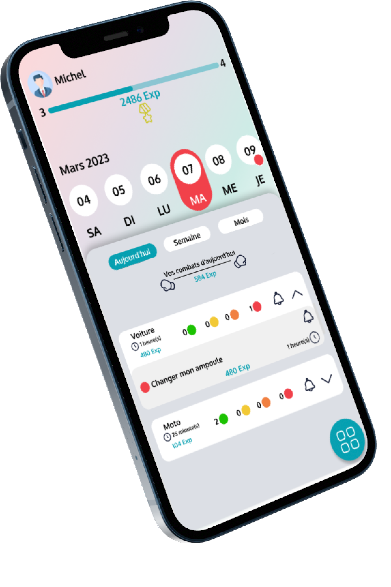

# Battletask (IOS, ANDROID & WEB)

     

BattleTask une application qui a pour but de révolutionner votre quotidien, tu en as marre d'utiliser une application classique pour te rappeler ce que tu dois faire dans tes journées ? BattleTask te permet de faire cela de manière ludique Tout en créant des collections qui concernent tes courses ou bien ta voiture tu pourras créer des tâches liées à ces collections et choisir si elle doit te rappeler toute ta collection ou une tâche spécifique et ce n'est pas tout tu pourras choisir la difficulté de ta tâche et une fois cette dernière accomplie tu obtiendras de l'expérience ! Ce qui te fera gagner des niveaux ce qui t'encouragera à les accomplir plus la tâche est difficile et prend du temps plus vite tu progresseras à toi les combats quotidiens !

## Maquettes

 

## Outils utilisé

- Figma
- MetroRetro
- GitLab
- Draw.io
- Trello
